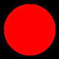
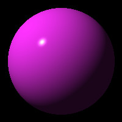
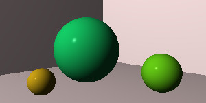
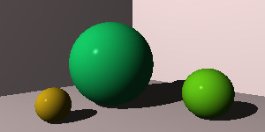

# Raytracer
Offline raytracing! Math! Oh My!

## Overview
This raytracer is being made from guidance with [The Ray Tracer Challenge](https://pragprog.com/titles/jbtracer/the-ray-tracer-challenge/)
from The Pragmatic Bookshelf. 

TL;DR the book gives you defined test cases to pass and some general concepts. No copy pasting code from a book or tutorial here.

This is my attempt at the project, along with any extra features I decide to add on in the future.

## Build Guide
This is my first attempt at using cmake since I wanted to use C++ for this particular project and wanted it to be crossplatform ish at best. but here's a quick run down tutorial of the set up: 
1. In the root of the repository where CMakeLists.txt is located, run `cmake -B<build directory location>` to create a build of the project. 
2. in the created build director run `make` to create the executable assuming you are running on a UNIX system. 
3. run `./main` in the terminal and boom you got yourself a program

Note: If you decide to generate a project for your favorite IDE, note that I built a majority of this project using Visual Studio's ability to manage CMake projects, so mileage may vary for other IDE's

## Known Issues

* Tests only pass fully on MSVC compiler, GCC has a segfault when running gtest but the main program still works as intended as of October 2023, will get it passing on gcc at a later date

### Milestone Images
_images are created in the ppm file format then exported to jpg using GIMP_
1) Printing a image to a screen using a progam to simulate a cannon shooting a projectile and recording the arc path

2) Printing a "clock" of pixels at 12 locations using matrix transformation definitions 

3) Printing a unlit, unshaded sphere in 3D space  

4) Printing a shaded, lit sphere using a basic Phong material  

5) Printing a lit scene with no shadows  

6) Printing a lit scene with shadows  

